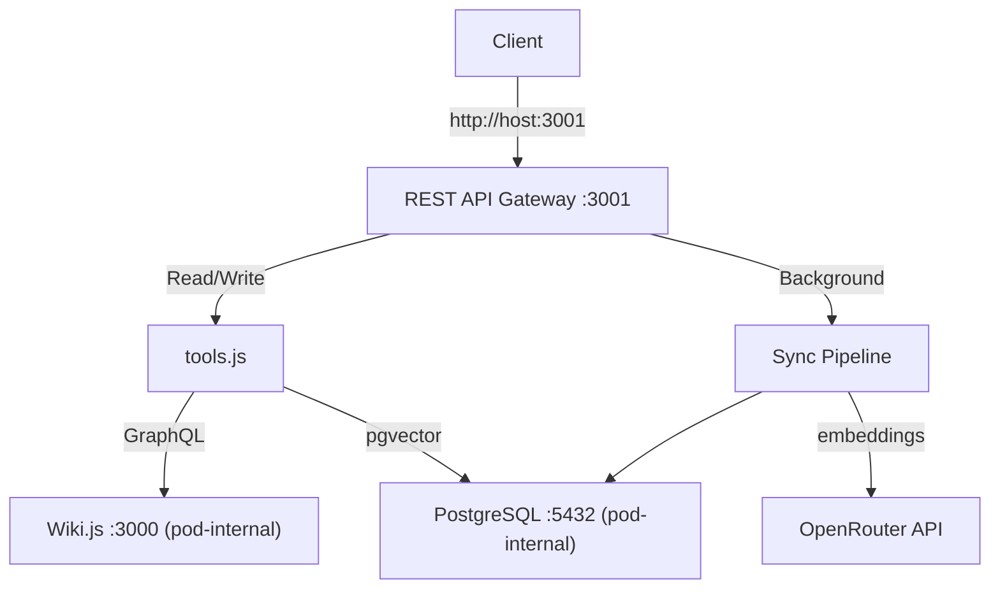

# Wiki.js Infrastructure

Deployment and management of Wiki.js with an integrated REST API gateway providing semantic vector search and page CRUD operations, powered by OpenRouter embeddings.

## Overview

Automated deployment of Wiki.js with PostgreSQL (pgvector) and a REST API gateway that exposes HTTP/JSON endpoints for searching and managing wiki content. The gateway is the sole entry point — Wiki.js and PostgreSQL are pod-internal only. Built for ARM64 on OCI Always Free tier.

## Features

- REST API Gateway with page CRUD and semantic vector search
- Two-tier API key authentication (read-only / read-write)
- Background embedding sync pipeline (OpenRouter text-embedding-3-small)
- Podman pod deployment with systemd auto-start
- ARM64 optimized (VM.Standard.A1.Flex)
- Only port 3001 exposed; Wiki.js and PostgreSQL are pod-internal

## Architecture



## Quick Start

1. Copy `.env.example` to `.env` and configure credentials
2. Deploy:
   ```bash
   API_KEY_RO=my-read-key OPENROUTER_API_KEY=sk-or-v1-... ./scripts/deploy-wikijs.sh deploy
   ```
3. Test:
   ```bash
   curl -H "Authorization: Bearer my-read-key" http://localhost:3001/api/pages
   ```

## Documentation

- [API Reference](docs/API.md) — REST endpoints, request/response schemas
- [Deployment Guide](docs/DEPLOYMENT.md) — Deployment instructions and troubleshooting
- [Testing Guide](docs/TESTING.md) — Unit, integration, property-based, and smoke tests
- [Client Configuration](docs/CLIENT_CONFIG.md) — How to connect to the gateway
- [Migration Guide](docs/MIGRATION.md) — Migrating from agent-infra
- [Wiki.js API Reference](docs/WIKI-API.md) — Underlying Wiki.js GraphQL API (used internally)

## Repository Structure

```
wikijs-infra/
├── services/wiki-api-gateway/   # REST API gateway
│   ├── src/
│   │   ├── index.js             # Entrypoint — config, DB, sync, Express listen
│   │   ├── server.js            # Express app factory
│   │   ├── config.js            # Environment variable loading/validation
│   │   ├── middleware/auth.js   # API key auth and access tiers
│   │   ├── routes/health.js     # GET /health (no auth)
│   │   ├── routes/pages.js      # /api/pages CRUD endpoints
│   │   ├── routes/search.js     # POST /api/search semantic search
│   │   ├── tools.js             # Business logic handlers
│   │   ├── wiki-client.js       # Wiki.js GraphQL client
│   │   ├── client.js            # HTTP client utilities
│   │   ├── embeddings.js        # OpenRouter embeddings client
│   │   ├── sync.js              # Background sync pipeline
│   │   ├── db.js                # PostgreSQL/pgvector operations
│   │   ├── chunker.js           # Text chunking for embeddings
│   │   └── json-utils.js        # JSON response utilities
│   ├── Dockerfile               # ARM64 container image
│   └── init-pgvector.sql        # Database schema initialization
├── scripts/
│   ├── deploy-wikijs.sh         # Deploy/manage the pod
│   ├── smoke-test-wikijs.sh     # End-to-end smoke test
│   ├── backup-embeddings.sh     # Embedding backup utility
│   └── scan-secrets.sh          # Secret scanning
├── docs/                        # Documentation
├── .env.example                 # Environment variable template
└── README.md
```

## Requirements

- OCI VM.Standard.A1.Flex instance (ARM64) with Podman
- Node.js 20+ (for local development)
- OpenRouter API key (for embeddings)
- At least one API key (read-only or read-write)

## License

MIT
