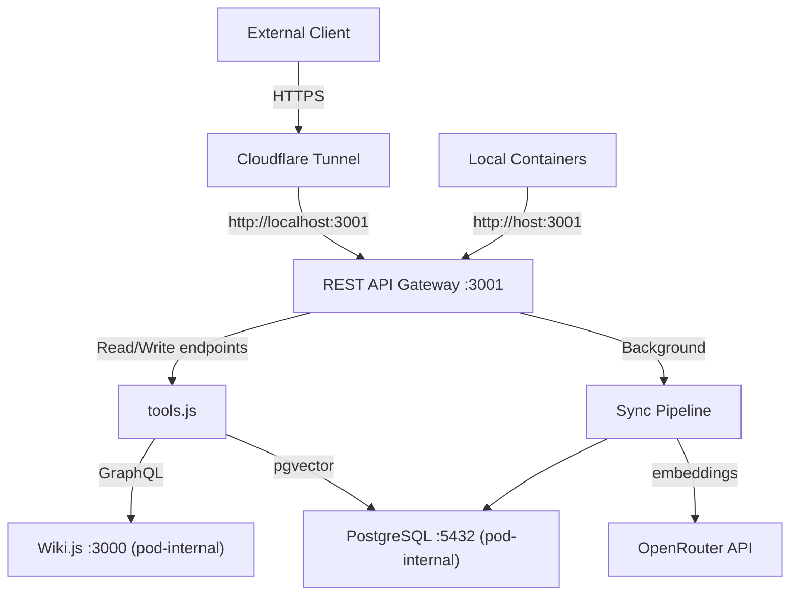

# Wiki.js Infrastructure Repository

Dedicated repository for managing Wiki.js deployment with an integrated REST API gateway providing semantic vector search and page CRUD operations, powered by OpenRouter embeddings.

## Overview

This repository provides automated deployment of Wiki.js with PostgreSQL (pgvector extension) and a REST API gateway that exposes plain HTTP/JSON endpoints for searching and managing wiki content. The gateway is the sole entry point — Wiki.js and PostgreSQL are pod-internal only, not exposed to the host. The design emphasizes ARM64 architecture for cost optimization on OCI Always Free tier, secure credential management, and comprehensive testing infrastructure.

## Features

- **REST API Gateway**: Plain HTTP/JSON endpoints for page CRUD and semantic search, authenticated via API keys
- **Semantic Search**: Vector search over Wiki.js content using OpenRouter embeddings (text-embedding-3-small)
- **Two-Tier Access Control**: Separate read-only and read-write API keys with constant-time comparison
- **Automated Deployment**: Podman-based deployment scripts with systemd integration
- **ARM64 Optimized**: Built for OCI Always Free tier (VM.Standard.A1.Flex)
- **Background Sync Pipeline**: Automatic embedding generation for new/updated pages
- **Secure by Default**: Only the gateway port (3001) is exposed; Wiki.js and PostgreSQL are pod-internal

## Architecture



## Quick Start

1. Copy `.env.example` to `.env` and configure your credentials
2. Run `API_KEY_RO=my-read-key OPENROUTER_API_KEY=sk-or-v1-... ./scripts/deploy-wikijs.sh deploy`
3. Access the gateway at `http://localhost:3001`
4. Test: `curl -H "Authorization: Bearer my-read-key" http://localhost:3001/api/pages`

## Documentation

- [API Reference](docs/API.md) — REST API endpoints, request/response schemas
- [Deployment Guide](docs/DEPLOYMENT.md) — Deployment instructions and troubleshooting
- [Testing Guide](docs/TESTING.md) — Unit, integration, property-based, and smoke tests
- [Client Configuration](docs/CLIENT_CONFIG.md) — How to connect to the gateway
- [Migration Guide](docs/MIGRATION.md) — Migrating from agent-infra
- [Wiki.js API Reference](docs/WIKI-API.md) — Underlying Wiki.js API reference (used internally by the gateway)

## Repository Structure

```
wikijs-infra/
├── services/wiki-api-gateway/   # REST API gateway source code
│   ├── src/
│   │   ├── index.js           # Entrypoint — config, DB, sync, Express listen
│   │   ├── server.js          # Express app factory
│   │   ├── config.js          # Environment variable loading and validation
│   │   ├── middleware/auth.js  # API key authentication and access tiers
│   │   ├── routes/health.js   # GET /health (no auth)
│   │   ├── routes/pages.js    # /api/pages CRUD endpoints
│   │   ├── routes/search.js   # POST /api/search semantic search
│   │   ├── tools.js           # Business logic handlers
│   │   ├── wiki-client.js     # Wiki.js GraphQL client
│   │   ├── embeddings.js      # OpenRouter embeddings client
│   │   ├── sync.js            # Background sync pipeline
│   │   ├── db.js              # PostgreSQL/pgvector operations
│   │   └── chunker.js         # Text chunking for embeddings
│   └── Dockerfile             # ARM64 container image
├── scripts/                   # Deployment and management scripts
├── docs/                      # Documentation
├── .env.example               # Environment variable template
└── README.md
```

## Requirements

- OCI VM.Standard.A1.Flex instance (ARM64) with Podman
- Node.js 20+ (for local development)
- OpenRouter API key (for embeddings)
- At least one API key (read-only or read-write)

## License

MIT
