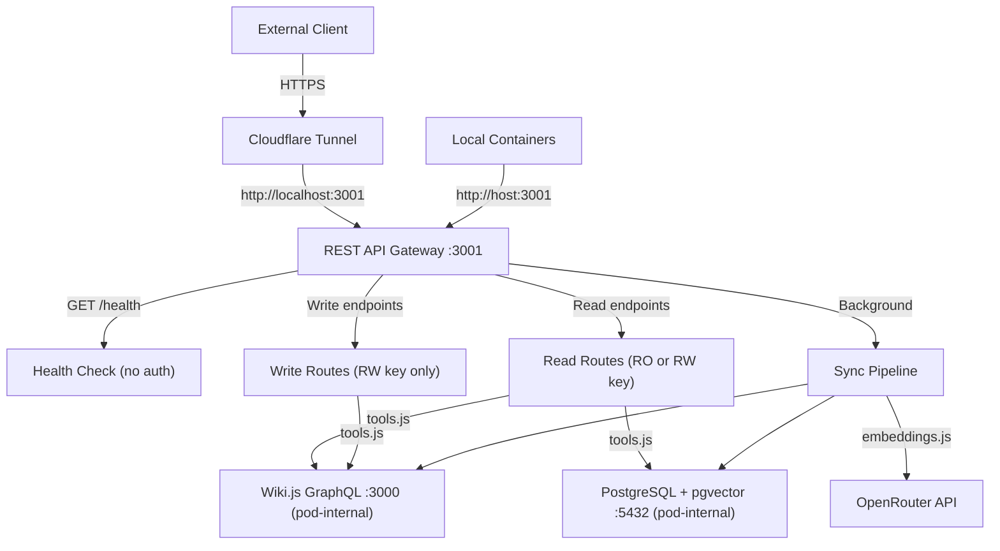

# Wiki REST API Gateway — API Reference

## Overview

The Wiki REST API Gateway provides HTTP/JSON endpoints for Wiki.js page CRUD and semantic vector search. It replaces the former MCP (Model Context Protocol) server with plain REST endpoints, authenticated via a two-tier API key system.

**Base URL:** `http://localhost:3001` (or via Cloudflare tunnel)
**Protocol:** HTTP/JSON
**Authentication:** Bearer API key in `Authorization` header

## Architecture



## Authentication

All endpoints except `GET /health` require a Bearer API key:

```
Authorization: Bearer <API_KEY>
```

Two access tiers are supported:

| Tier | Key Variable | Access |
|------|-------------|--------|
| Read-only | `API_KEY_RO` | GET endpoints + POST /api/search |
| Read-write | `API_KEY_RW` | All endpoints including mutations |

Keys are compared using `crypto.timingSafeEqual` to prevent timing attacks.

**Missing/invalid key:** `401 {"error": "Unauthorized"}`
**RO key on write endpoint:** `403 {"error": "Forbidden: read-only key cannot access write endpoints"}`

## Endpoint Summary

| Method | Path | Auth | Description |
|--------|------|------|-------------|
| GET | `/health` | None | Health check |
| GET | `/api/pages` | RO/RW | List all pages |
| GET | `/api/pages/by-path?path=...` | RO/RW | Get page by path |
| GET | `/api/pages/:id` | RO/RW | Get page by ID |
| POST | `/api/search` | RO/RW | Semantic vector search |
| POST | `/api/pages` | RW only | Create page |
| PUT | `/api/pages/:id` | RW only | Update page |
| DELETE | `/api/pages/:id` | RW only | Delete page |
| POST | `/api/pages/:id/move` | RW only | Move/rename page |

---

## Read Endpoints

### GET /health

Health check — no authentication required.

**Response:** `200`
```json
{"status": "ok"}
```

### GET /api/pages

List all wiki pages, ordered by most recently updated.

**Response:** `200`
```json
[
  {
    "id": 1,
    "path": "/home",
    "title": "Home",
    "updatedAt": "2026-03-10T14:30:00Z"
  }
]
```

### GET /api/pages/:id

Get a page by its numeric ID.

**Parameters:**
- `:id` — positive integer (path parameter)

**Response:** `200`
```json
{
  "id": 42,
  "title": "Authentication Setup",
  "path": "/admin/authentication",
  "content": "# Authentication Setup\n...",
  "updatedAt": "2026-03-10T14:30:00Z"
}
```

**Errors:**
- `400` — `:id` is not a valid positive integer
- `404` — page not found

### GET /api/pages/by-path?path=...

Get a page by its path.

**Query Parameters:**
- `path` — page path string (required)

**Response:** `200`
```json
{
  "id": 42,
  "title": "Authentication Setup",
  "path": "/admin/authentication",
  "content": "# Authentication Setup\n...",
  "updatedAt": "2026-03-10T14:30:00Z"
}
```

**Errors:**
- `400` — `path` query parameter missing or empty
- `404` — page not found at given path

### POST /api/search

Semantic vector search over wiki content using OpenRouter embeddings.

**Request Body:**
```json
{
  "query": "how to configure authentication",
  "top_k": 5
}
```

| Field | Type | Required | Default | Description |
|-------|------|----------|---------|-------------|
| `query` | string | Yes | — | Natural language search query |
| `top_k` | number | No | 5 | Results to return (1–20) |

**Response:** `200`
```json
[
  {
    "page_id": 42,
    "page_title": "Authentication Setup",
    "page_path": "/admin/authentication",
    "chunk_text": "To configure authentication, navigate to...",
    "relevance_score": 0.87
  }
]
```

**Errors:**
- `400` — `query` missing or empty
- `502` — embedding generation or database query failed

---

## Write Endpoints

Write endpoints require a read-write API key (`API_KEY_RW`). The gateway uses a Wiki.js admin JWT token (`WIKI_ADMIN_TOKEN`) internally to execute GraphQL mutations.

### POST /api/pages

Create a new wiki page.

**Request Body:**
```json
{
  "title": "Getting Started",
  "path": "/getting-started",
  "content": "# Getting Started\n\nWelcome...",
  "description": "Intro guide",
  "tags": ["tutorial"],
  "isPublished": true,
  "isPrivate": false,
  "locale": "en"
}
```

| Field | Type | Required | Default | Description |
|-------|------|----------|---------|-------------|
| `title` | string | Yes | — | Page title |
| `path` | string | Yes | — | Page path |
| `content` | string | Yes | — | Markdown content |
| `description` | string | No | `""` | Page description |
| `tags` | string[] | No | `[]` | Tag strings |
| `isPublished` | boolean | No | `true` | Published status |
| `isPrivate` | boolean | No | `false` | Private status |
| `locale` | string | No | `"en"` | Page locale |

**Response:** `201`
```json
{
  "page_id": 43,
  "path": "/getting-started",
  "title": "Getting Started",
  "success": true,
  "message": "Page created successfully"
}
```

**Errors:**
- `400` — missing required fields (`title`, `path`, `content`)
- `409` — page already exists at the given path

### PUT /api/pages/:id

Update an existing page. Only provided fields are updated (partial update).

**Request Body:**
```json
{
  "content": "# Updated content...",
  "tags": ["tutorial", "updated"]
}
```

| Field | Type | Required | Description |
|-------|------|----------|-------------|
| `content` | string | No | New content |
| `title` | string | No | New title |
| `description` | string | No | New description |
| `tags` | string[] | No | New tags |
| `isPublished` | boolean | No | Published status |
| `isPrivate` | boolean | No | Private status |

**Response:** `200`
```json
{
  "page_id": 43,
  "updated_at": "2026-03-12T10:30:00Z",
  "success": true,
  "message": "Page updated successfully"
}
```

**Errors:**
- `400` — `:id` is not a valid positive integer
- `404` — page not found

### DELETE /api/pages/:id

Delete a page permanently.

**Response:** `200`
```json
{
  "page_id": 43,
  "success": true,
  "message": "Page deleted successfully"
}
```

**Errors:**
- `400` — `:id` is not a valid positive integer
- `404` — page not found

### POST /api/pages/:id/move

Move a page to a new path.

**Request Body:**
```json
{
  "destination_path": "/guides/getting-started",
  "destination_locale": "en"
}
```

| Field | Type | Required | Default | Description |
|-------|------|----------|---------|-------------|
| `destination_path` | string | Yes | — | New page path |
| `destination_locale` | string | No | `"en"` | Destination locale |

**Response:** `200`
```json
{
  "page_id": 43,
  "old_path": "/getting-started",
  "new_path": "/guides/getting-started",
  "success": true,
  "message": "Page moved successfully"
}
```

**Errors:**
- `400` — `:id` invalid or `destination_path` missing
- `404` — source page not found

---

## Error Responses

All errors return JSON with an `error` field:

```json
{"error": "Descriptive error message"}
```

| HTTP Status | Meaning |
|-------------|---------|
| 400 | Bad request (invalid parameters or missing required fields) |
| 401 | Unauthorized (missing or invalid API key) |
| 403 | Forbidden (read-only key on write endpoint) |
| 404 | Not found (page doesn't exist) |
| 409 | Conflict (page already exists at path) |
| 500 | Internal server error (unhandled exception) |
| 502 | Bad gateway (upstream embedding or database failure) |

---

## Background Sync Pipeline

The gateway runs a background process that keeps embeddings in sync with Wiki.js content:

1. Polls Wiki.js GraphQL API every 5 minutes (configurable via `SYNC_INTERVAL_MS`)
2. Detects new, updated, or deleted pages
3. Chunks page content into searchable segments
4. Generates embeddings using OpenRouter (text-embedding-3-small, 1536 dimensions)
5. Upserts embeddings into PostgreSQL with pgvector

New or updated pages appear in search results within one sync cycle.

---

## Configuration

| Variable | Required | Default | Description |
|----------|----------|---------|-------------|
| `API_KEY_RO` | At least one key | — | Read-only API key |
| `API_KEY_RW` | At least one key | — | Read-write API key |
| `WIKI_ADMIN_TOKEN` | If `API_KEY_RW` set | — | Wiki.js admin JWT for write mutations |
| `OPENROUTER_API_KEY` | Yes | — | OpenRouter API key for embeddings |
| `EMBEDDING_MODEL` | No | `openai/text-embedding-3-small` | Embedding model |
| `OPENROUTER_BASE_URL` | No | `https://openrouter.ai/api/v1` | OpenRouter API URL |
| `GATEWAY_PORT` | No | `3001` | HTTP listen port |
| `WIKI_BASE_URL` | No | `http://localhost:3000` | Wiki.js GraphQL endpoint (pod-internal) |
| `PGHOST` | No | `localhost` | PostgreSQL host |
| `PGPORT` | No | `5432` | PostgreSQL port |
| `PGDATABASE` | No | `wiki` | PostgreSQL database |
| `PGUSER` | No | `wiki` | PostgreSQL user |
| `PGPASSWORD` | No | — | PostgreSQL password |
| `SYNC_INTERVAL_MS` | No | `300000` | Sync pipeline polling interval (ms) |

---

## Database Schema

```sql
CREATE TABLE IF NOT EXISTS wiki_embeddings (
  id SERIAL PRIMARY KEY,
  page_id INTEGER NOT NULL,
  page_path TEXT NOT NULL,
  page_title TEXT NOT NULL,
  chunk_index INTEGER NOT NULL,
  chunk_text TEXT NOT NULL,
  embedding vector(1024),
  updated_at TIMESTAMP DEFAULT NOW(),
  UNIQUE(page_id, chunk_index)
);

CREATE INDEX IF NOT EXISTS idx_embeddings_page_id ON wiki_embeddings(page_id);
CREATE INDEX IF NOT EXISTS idx_embeddings_vector
  ON wiki_embeddings USING ivfflat (embedding vector_cosine_ops)
  WITH (lists = 100);
```

---

## Deployment

The gateway runs as a container in a Podman pod alongside Wiki.js and PostgreSQL:

```bash
# Deploy the full stack
API_KEY_RO=my-key OPENROUTER_API_KEY=sk-or-v1-... ./scripts/deploy-wikijs.sh deploy

# Check gateway logs
podman logs wikijs-gateway

# Restart gateway
podman restart wikijs-gateway
```

Container details:
- Image: `wikijs-gateway:latest`
- Platform: `linux/arm64`
- Port: `3001` (only port exposed from pod)
- Network: Shares pod network with Wiki.js and PostgreSQL

See [DEPLOYMENT.md](./DEPLOYMENT.md) for the full deployment guide.

---

## Usage Examples

```bash
# List pages
curl -H "Authorization: Bearer $API_KEY_RO" http://localhost:3001/api/pages

# Get page by ID
curl -H "Authorization: Bearer $API_KEY_RO" http://localhost:3001/api/pages/42

# Get page by path
curl -H "Authorization: Bearer $API_KEY_RO" "http://localhost:3001/api/pages/by-path?path=/home"

# Semantic search
curl -X POST -H "Authorization: Bearer $API_KEY_RO" -H "Content-Type: application/json" \
  -d '{"query": "how to configure auth", "top_k": 5}' \
  http://localhost:3001/api/search

# Create page (requires RW key)
curl -X POST -H "Authorization: Bearer $API_KEY_RW" -H "Content-Type: application/json" \
  -d '{"title": "New Page", "path": "/new-page", "content": "# Hello"}' \
  http://localhost:3001/api/pages

# Update page
curl -X PUT -H "Authorization: Bearer $API_KEY_RW" -H "Content-Type: application/json" \
  -d '{"content": "# Updated content"}' \
  http://localhost:3001/api/pages/42

# Delete page
curl -X DELETE -H "Authorization: Bearer $API_KEY_RW" http://localhost:3001/api/pages/42

# Move page
curl -X POST -H "Authorization: Bearer $API_KEY_RW" -H "Content-Type: application/json" \
  -d '{"destination_path": "/new-location"}' \
  http://localhost:3001/api/pages/42/move
```

---

## References

- [Deployment Guide](./DEPLOYMENT.md)
- [Testing Guide](./TESTING.md)
- [Client Configuration](./CLIENT_CONFIG.md)
- [Wiki.js GraphQL API](./WIKI-API.md) — underlying API used by the gateway internally
- [pgvector Documentation](https://github.com/pgvector/pgvector)
- [OpenRouter API](https://openrouter.ai/docs)
