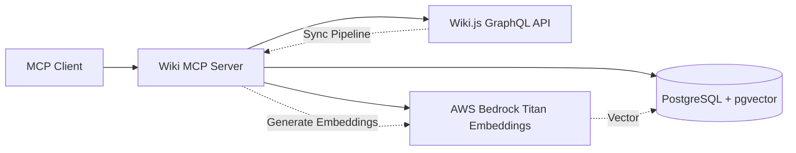

# Wiki MCP Server API Documentation

## Overview

The Wiki MCP Server provides semantic vector search capabilities over Wiki.js content through the Model Context Protocol (MCP). It exposes tools for searching and retrieving wiki pages using natural language queries.

**Version:** 1.0.0  
**Protocol:** MCP (Model Context Protocol) over stdio  
**Transport:** Standard input/output (stdio)

## Architecture



## Features

- **Semantic Search**: Natural language search using vector embeddings
- **Page Retrieval**: Fetch full page content by ID or path
- **Background Sync**: Automatic embedding generation for new/updated pages
- **Chunked Content**: Large pages split into searchable chunks
- **Relevance Scoring**: Cosine similarity scoring for search results

## Tools

### 1. search_wiki

Performs semantic vector search over wiki content using natural language queries.

**Parameters:**

| Parameter | Type | Required | Default | Description |
|-----------|------|----------|---------|-------------|
| `query` | string | Yes | - | Natural language search query |
| `top_k` | number | No | 5 | Number of results to return (1-20) |

**Request Example:**

```json
{
  "method": "tools/call",
  "params": {
    "name": "search_wiki",
    "arguments": {
      "query": "How do I configure authentication?",
      "top_k": 5
    }
  }
}
```

**Response Schema:**

```typescript
Array<{
  page_id: number;
  page_title: string;
  page_path: string;
  chunk_text: string;
  relevance_score: number;
}>
```

**Response Example (Success):**

```json
{
  "content": [
    {
      "type": "text",
      "text": "[{\"page_id\":42,\"page_title\":\"Authentication Setup\",\"page_path\":\"/admin/auth\",\"chunk_text\":\"To configure authentication, navigate to the Admin panel...\",\"relevance_score\":0.89},{\"page_id\":15,\"page_title\":\"User Management\",\"page_path\":\"/admin/users\",\"chunk_text\":\"Authentication providers can be configured...\",\"relevance_score\":0.76}]"
    }
  ]
}
```

**Response Example (Error):**

```json
{
  "content": [
    {
      "type": "text",
      "text": "{\"error\":\"Search failed: Connection to database timed out\"}"
    }
  ]
}
```

**Behavior:**

- Empty query returns empty array `[]`
- Results ordered by relevance score (highest first)
- Relevance score range: 0.0 to 1.0
- Returns chunks from multiple pages if relevant
- Multiple chunks from same page may appear in results

### 2. get_wiki_page

Retrieves full page content by page ID or path.

**Parameters:**

| Parameter | Type | Required | Description |
|-----------|------|----------|-------------|
| `page_id` | number | No* | Wiki page ID |
| `path` | string | No* | Wiki page path (e.g., `/home`, `/admin/users`) |

*At least one parameter must be provided. If both provided, `page_id` takes precedence.

**Request Example (by ID):**

```json
{
  "method": "tools/call",
  "params": {
    "name": "get_wiki_page",
    "arguments": {
      "page_id": 42
    }
  }
}
```

**Request Example (by path):**

```json
{
  "method": "tools/call",
  "params": {
    "name": "get_wiki_page",
    "arguments": {
      "path": "/admin/authentication"
    }
  }
}
```

**Response Schema:**

```typescript
{
  page_id: number;
  title: string;
  path: string;
  content: string;        // Full markdown content
  updated_at: string;     // ISO 8601 timestamp
}
```

**Response Example (Success):**

```json
{
  "content": [
    {
      "type": "text",
      "text": "{\"page_id\":42,\"title\":\"Authentication Setup\",\"path\":\"/admin/auth\",\"content\":\"# Authentication Setup\\n\\nThis guide covers...\\n\",\"updated_at\":\"2026-03-10T14:30:00Z\"}"
    }
  ]
}
```

**Response Example (Error):**

```json
{
  "content": [
    {
      "type": "text",
      "text": "{\"error\":\"Failed to retrieve page: Page not found: /invalid/path\"}"
    }
  ]
}
```

**Behavior:**

- Returns full markdown content (not chunked)
- Path matching is case-sensitive
- Locale defaults to `en` for path-based lookups
- Returns error if page doesn't exist

## Error Handling

All tools return errors as JSON objects with an `error` field rather than throwing exceptions.

**Error Response Format:**

```json
{
  "error": "Descriptive error message"
}
```

**Common Error Scenarios:**

| Error | Cause | Resolution |
|-------|-------|------------|
| `Search failed: Connection to database timed out` | Database unavailable | Check PostgreSQL container status |
| `Failed to retrieve page: Page not found: <path>` | Invalid page path/ID | Verify page exists in Wiki.js |
| `Search failed: Bedrock API error` | AWS credentials or quota issue | Check AWS credentials and Bedrock access |
| `Either page_id or path must be provided` | Missing required parameters | Provide at least one parameter |

## Configuration

The MCP server is configured via environment variables:

| Variable | Required | Default | Description |
|----------|----------|---------|-------------|
| `PGHOST` | Yes | `localhost` | PostgreSQL host |
| `PGPORT` | No | `5432` | PostgreSQL port |
| `PGDATABASE` | Yes | `wiki` | PostgreSQL database name |
| `PGUSER` | Yes | `wiki` | PostgreSQL username |
| `PGPASSWORD` | Yes | - | PostgreSQL password |
| `WIKI_BASE_URL` | Yes | `http://localhost:3000` | Wiki.js base URL |
| `SYNC_INTERVAL_MS` | No | `300000` | Embedding sync interval (5 minutes) |
| `AWS_REGION` | Yes | `us-east-1` | AWS region for Bedrock |
| `AWS_DEFAULT_REGION` | Yes | `us-east-1` | AWS default region |

## Background Sync Pipeline

The server runs a background process that:

1. Polls Wiki.js GraphQL API every 5 minutes (configurable)
2. Detects new, updated, or deleted pages
3. Chunks page content into searchable segments
4. Generates embeddings using AWS Bedrock Titan Embeddings v2
5. Upserts embeddings into PostgreSQL with pgvector

**Sync Behavior:**

- Only processes pages modified since last sync
- Deletes embeddings for deleted pages
- Updates embeddings for modified pages
- Chunks large pages (max 512 tokens per chunk)
- Runs continuously in background

## Database Schema

The server uses PostgreSQL with pgvector extension:

```sql
CREATE TABLE IF NOT EXISTS page_embeddings (
  id SERIAL PRIMARY KEY,
  page_id INTEGER NOT NULL,
  page_title TEXT NOT NULL,
  page_path TEXT NOT NULL,
  chunk_index INTEGER NOT NULL,
  chunk_text TEXT NOT NULL,
  embedding vector(1024) NOT NULL,
  updated_at TIMESTAMPTZ NOT NULL DEFAULT NOW(),
  UNIQUE(page_id, chunk_index)
);

CREATE INDEX IF NOT EXISTS idx_page_embeddings_vector 
  ON page_embeddings USING ivfflat (embedding vector_cosine_ops);
```

## Performance Considerations

**Search Performance:**

- Vector search uses IVFFlat index for fast similarity search
- Typical query time: 10-50ms for databases with <10,000 chunks
- Performance degrades with >100,000 chunks (consider tuning)

**Embedding Generation:**

- Bedrock Titan Embeddings v2: ~100ms per chunk
- Sync pipeline processes pages sequentially
- Large wikis (>1000 pages) may take 10-20 minutes for initial sync

**Resource Usage:**

- Memory: ~100MB base + ~1KB per embedded chunk
- CPU: Minimal (I/O bound)
- Network: Bedrock API calls during sync

## Security Considerations

1. **No Authentication**: MCP server has no built-in auth
   - Deploy behind Cloudflare tunnel with Zero Trust
   - Use service tokens for machine-to-machine access
   - Restrict network access via firewall rules

2. **Database Access**: Server has full read access to Wiki.js database
   - Use read-only database credentials if possible
   - Isolate in private network

3. **AWS Credentials**: Requires Bedrock access
   - Use IAM roles with minimal permissions
   - Only grant `bedrock:InvokeModel` for Titan Embeddings

## Deployment

The server is deployed as a Docker container in a Podman pod alongside Wiki.js:

```bash
# Deploy the full stack
./scripts/deploy-wikijs.sh deploy

# Check MCP server logs
podman logs wikijs-mcp

# Restart MCP server
podman restart wikijs-mcp
```

**Container Details:**

- Image: `wikijs-mcp-server:latest`
- Platform: `linux/arm64`
- Port: `3001` (exposed on host)
- Network: Shares pod network with Wiki.js and PostgreSQL

## Testing

See [TESTING.md](./TESTING.md) for comprehensive testing guide including:

- Unit tests
- Integration tests (local containers)
- Smoke tests (live OCI deployment)

## Limitations

1. **Read-Only**: No support for creating/updating/deleting pages
2. **English Only**: Embedding model optimized for English content
3. **Locale**: Path-based lookups default to `en` locale
4. **Chunk Size**: Fixed at 512 tokens (not configurable)
5. **Sync Delay**: New pages take up to 5 minutes to appear in search

## Future Enhancements

Potential additions to the API:

- `create_wiki_page` - Create new pages
- `update_wiki_page` - Update existing pages
- `delete_wiki_page` - Delete pages
- `move_wiki_page` - Move/rename pages
- `list_wiki_pages` - List all pages with filters
- `get_page_tree` - Get hierarchical page structure

See [WIKI-GRAPHQL-API.md](./WIKI-GRAPHQL-API.md) for underlying Wiki.js API capabilities.

## Support

For issues or questions:

1. Check logs: `podman logs wikijs-mcp`
2. Verify configuration: `podman exec wikijs-mcp env | grep -E 'PG|WIKI|AWS'`
3. Test database: `podman exec wikijs-postgres psql -U wiki -d wiki -c 'SELECT COUNT(*) FROM page_embeddings;'`
4. Review [TROUBLESHOOTING.md](./TROUBLESHOOTING.md) (if available)

## References

- [Model Context Protocol Specification](https://modelcontextprotocol.io/)
- [Wiki.js GraphQL API](./WIKI-GRAPHQL-API.md)
- [AWS Bedrock Titan Embeddings](https://docs.aws.amazon.com/bedrock/latest/userguide/titan-embedding-models.html)
- [pgvector Documentation](https://github.com/pgvector/pgvector)


## Write Operation Tools

The following tools are available when `ENABLE_WRITE_OPERATIONS=true` and `WIKI_ADMIN_TOKEN` is configured.

### 3. create_wiki_page

Creates a new wiki page with the specified content and metadata.

**Parameters:**

| Parameter | Type | Required | Default | Description |
|-----------|------|----------|---------|-------------|
| `title` | string | Yes | - | Page title |
| `path` | string | Yes | - | Page path (e.g., `/guides/new-page`) |
| `content` | string | Yes | - | Page content (markdown) |
| `description` | string | No | `""` | Page description/summary |
| `tags` | array | No | `[]` | Array of tag strings |
| `is_published` | boolean | No | `true` | Whether page is published |
| `is_private` | boolean | No | `false` | Whether page is private |
| `locale` | string | No | `"en"` | Page locale |
| `editor` | string | No | `"markdown"` | Editor type |

**Request Example:**

```json
{
  "method": "tools/call",
  "params": {
    "name": "create_wiki_page",
    "arguments": {
      "title": "Getting Started Guide",
      "path": "/guides/getting-started",
      "content": "# Getting Started\n\nWelcome to our wiki...",
      "description": "A guide for new users",
      "tags": ["guide", "tutorial", "beginner"],
      "is_published": true
    }
  }
}
```

**Response Schema:**

```typescript
{
  page_id: number;
  path: string;
  title: string;
  success: boolean;
  message: string;
}
```

**Response Example (Success):**

```json
{
  "content": [
    {
      "type": "text",
      "text": "{\"page_id\":123,\"path\":\"/guides/getting-started\",\"title\":\"Getting Started Guide\",\"success\":true,\"message\":\"Page created successfully\"}"
    }
  ]
}
```

**Response Example (Error):**

```json
{
  "content": [
    {
      "type": "text",
      "text": "{\"success\":false,\"message\":\"Page already exists at path: /guides/getting-started\"}"
    }
  ]
}
```

**Behavior:**

- Path must be unique (returns error if exists)
- Path must start with `/`
- Content is stored as markdown
- Embeddings generated automatically within 5 minutes
- Returns page_id for future operations

### 4. update_wiki_page

Updates an existing wiki page's content or metadata.

**Parameters:**

| Parameter | Type | Required | Description |
|-----------|------|----------|-------------|
| `page_id` | number | Yes | Page ID to update |
| `content` | string | No | New page content (markdown) |
| `title` | string | No | New page title |
| `description` | string | No | New page description |
| `tags` | array | No | New array of tags |
| `is_published` | boolean | No | Update published status |
| `is_private` | boolean | No | Update private status |

*At least one optional parameter must be provided.

**Request Example:**

```json
{
  "method": "tools/call",
  "params": {
    "name": "update_wiki_page",
    "arguments": {
      "page_id": 123,
      "content": "# Getting Started (Updated)\n\nWelcome to our updated wiki...",
      "tags": ["guide", "tutorial", "beginner", "updated"]
    }
  }
}
```

**Response Schema:**

```typescript
{
  page_id: number;
  updated_at: string;  // ISO 8601 timestamp
  success: boolean;
  message: string;
}
```

**Response Example (Success):**

```json
{
  "content": [
    {
      "type": "text",
      "text": "{\"page_id\":123,\"updated_at\":\"2026-03-12T10:30:00Z\",\"success\":true,\"message\":\"Page updated successfully\"}"
    }
  ]
}
```

**Response Example (Error):**

```json
{
  "content": [
    {
      "type": "text",
      "text": "{\"success\":false,\"message\":\"Page not found: 999\"}"
    }
  ]
}
```

**Behavior:**

- Only specified fields are updated (partial updates supported)
- Embeddings regenerated automatically within 5 minutes
- Returns updated timestamp
- Page must exist (returns error if not found)

### 5. delete_wiki_page

Deletes a wiki page and its associated embeddings.

**Parameters:**

| Parameter | Type | Required | Description |
|-----------|------|----------|-------------|
| `page_id` | number | Yes | Page ID to delete |

**Request Example:**

```json
{
  "method": "tools/call",
  "params": {
    "name": "delete_wiki_page",
    "arguments": {
      "page_id": 123
    }
  }
}
```

**Response Schema:**

```typescript
{
  page_id: number;
  success: boolean;
  message: string;
}
```

**Response Example (Success):**

```json
{
  "content": [
    {
      "type": "text",
      "text": "{\"page_id\":123,\"success\":true,\"message\":\"Page deleted successfully\"}"
    }
  ]
}
```

**Response Example (Error):**

```json
{
  "content": [
    {
      "type": "text",
      "text": "{\"success\":false,\"message\":\"Page not found: 999\"}"
    }
  ]
}
```

**Behavior:**

- Permanently deletes page from Wiki.js
- Embeddings removed automatically within 5 minutes
- Cannot be undone (no trash/recycle bin)
- Returns error if page doesn't exist

### 6. move_wiki_page

Moves or renames a wiki page to a new path.

**Parameters:**

| Parameter | Type | Required | Default | Description |
|-----------|------|----------|---------|-------------|
| `page_id` | number | Yes | - | Page ID to move |
| `destination_path` | string | Yes | - | New page path |
| `destination_locale` | string | No | `"en"` | Destination locale |

**Request Example:**

```json
{
  "method": "tools/call",
  "params": {
    "name": "move_wiki_page",
    "arguments": {
      "page_id": 123,
      "destination_path": "/guides/beginner/getting-started"
    }
  }
}
```

**Response Schema:**

```typescript
{
  page_id: number;
  old_path: string;
  new_path: string;
  success: boolean;
  message: string;
}
```

**Response Example (Success):**

```json
{
  "content": [
    {
      "type": "text",
      "text": "{\"page_id\":123,\"old_path\":\"/guides/getting-started\",\"new_path\":\"/guides/beginner/getting-started\",\"success\":true,\"message\":\"Page moved successfully\"}"
    }
  ]
}
```

**Response Example (Error):**

```json
{
  "content": [
    {
      "type": "text",
      "text": "{\"success\":false,\"message\":\"Destination path already exists: /guides/beginner/getting-started\"}"
    }
  ]
}
```

**Behavior:**

- Moves page to new path
- Content and metadata preserved
- Embeddings updated automatically with new path
- Returns error if destination exists
- Returns error if source page doesn't exist

## Write Operations Security

**Authentication:**
- Requires valid Wiki.js admin JWT token
- Token passed via `WIKI_ADMIN_TOKEN` environment variable
- Token stored as Podman secret (not plain text)

**Authorization:**
- All write operations require admin privileges
- No per-page or per-user permissions (uses Wiki.js admin token)
- Read operations don't require authentication

**Audit Trail:**
- All write operations logged in MCP server logs
- Wiki.js maintains its own audit log
- Recommend monitoring logs for unauthorized access

**Best Practices:**
1. Only enable write operations when needed
2. Use separate deployment for write-enabled instances
3. Restrict network access to write-enabled servers
4. Rotate admin tokens regularly (every 90 days)
5. Monitor logs for suspicious activity

## Updated Configuration

Additional environment variables for write operations:

| Variable | Required | Default | Description |
|----------|----------|---------|-------------|
| `ENABLE_WRITE_OPERATIONS` | No | `false` | Enable write operation tools |
| `WIKI_ADMIN_TOKEN` | Conditional* | - | Wiki.js admin JWT token |
| `OPENROUTER_API_KEY` | Yes | - | OpenRouter API key for embeddings |
| `EMBEDDING_MODEL` | No | `openai/text-embedding-3-small` | Embedding model to use |
| `OPENROUTER_BASE_URL` | No | `https://openrouter.ai/api/v1` | OpenRouter API base URL |

*Required when `ENABLE_WRITE_OPERATIONS=true`

## Updated Database Schema

Vector dimensions updated for OpenRouter embeddings:

```sql
CREATE TABLE IF NOT EXISTS wiki_embeddings (
  id SERIAL PRIMARY KEY,
  page_id INTEGER NOT NULL,
  page_title TEXT NOT NULL,
  page_path TEXT NOT NULL,
  chunk_index INTEGER NOT NULL,
  chunk_text TEXT NOT NULL,
  embedding vector(1536) NOT NULL,  -- Updated from 1024 to 1536
  updated_at TIMESTAMPTZ NOT NULL DEFAULT NOW(),
  UNIQUE(page_id, chunk_index)
);

CREATE INDEX IF NOT EXISTS idx_embeddings_vector 
  ON wiki_embeddings USING ivfflat (embedding vector_cosine_ops) 
  WITH (lists = 100);
```

## Updated Limitations

1. **Write Operations**: Optional, disabled by default for security
2. **English Only**: Embedding model optimized for English content
3. **Locale**: Path-based lookups default to `en` locale
4. **Chunk Size**: Fixed at 512 tokens (not configurable)
5. **Sync Delay**: New/updated pages take up to 5 minutes to appear in search
6. **No Bulk Operations**: Write operations are single-page only

## Migration from AWS Bedrock

The server now uses OpenRouter API instead of AWS Bedrock:

**Changes:**
- Embedding dimensions: 1024 → 1536
- API provider: AWS Bedrock → OpenRouter
- Model: Titan Embeddings v2 → text-embedding-3-small
- Configuration: AWS credentials → OpenRouter API key

**Migration:**
See [MIGRATION.md](./MIGRATION.md) for detailed migration guide.

## Deployment Modes

**Read-Only Deployment:**
```bash
OPENROUTER_API_KEY=sk-or-v1-... ./scripts/deploy-wikijs.sh deploy
```

**Read-Write Deployment:**
```bash
# Step 1: Deploy read-only
OPENROUTER_API_KEY=sk-or-v1-... ./scripts/deploy-wikijs.sh deploy

# Step 2: Get admin token
eval $(./scripts/deploy-wikijs.sh get-token)

# Step 3: Update with write operations
ENABLE_WRITE_OPERATIONS=true OPENROUTER_API_KEY=sk-or-v1-... ./scripts/deploy-wikijs.sh update
```

See [DEPLOYMENT.md](./DEPLOYMENT.md) for complete deployment guide.
