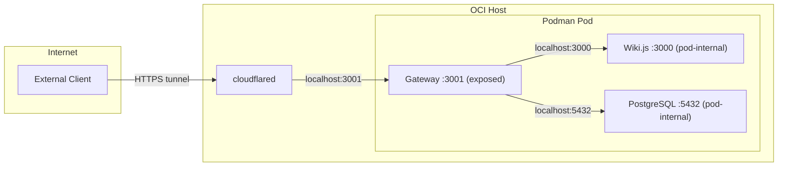

# Wiki REST API Gateway — Deployment Guide

## Overview

This guide covers deploying the Wiki REST API Gateway with OpenRouter embeddings, two-tier API key authentication, and optional write operations support. The gateway is the sole entry point to the stack — Wiki.js and PostgreSQL are pod-internal only.

## Prerequisites

- OCI VM.Standard.A1.Flex instance (ARM64)
- Podman installed
- OpenRouter API key from https://openrouter.ai/
- At least one API key (read-only or read-write)
- Wiki.js admin credentials (for write operations)

## Quick Start

### Read-Only Deployment

Deploy with search and page retrieval only:

```bash
API_KEY_RO=my-read-key \
OPENROUTER_API_KEY=sk-or-v1-your-key \
./scripts/deploy-wikijs.sh deploy
```

Available endpoints:
- `GET /api/pages` — list pages
- `GET /api/pages/:id` — get page by ID
- `GET /api/pages/by-path?path=...` — get page by path
- `POST /api/search` — semantic search

### Read-Write Deployment

Deploy with full CRUD operations:

```bash
# Step 1: Deploy read-only first
API_KEY_RO=my-read-key \
OPENROUTER_API_KEY=sk-or-v1-your-key \
./scripts/deploy-wikijs.sh deploy

# Step 2: Obtain Wiki.js admin JWT
eval $(./scripts/deploy-wikijs.sh get-token)

# Step 3: Update with read-write key
API_KEY_RO=my-read-key \
API_KEY_RW=my-write-key \
WIKI_ADMIN_TOKEN=$WIKI_ADMIN_TOKEN \
OPENROUTER_API_KEY=sk-or-v1-your-key \
./scripts/deploy-wikijs.sh update
```

Additional endpoints with RW key:
- `POST /api/pages` — create page
- `PUT /api/pages/:id` — update page
- `DELETE /api/pages/:id` — delete page
- `POST /api/pages/:id/move` — move page

## Obtaining Wiki.js Admin JWT Token

The JWT token is required for write operations (used internally by the gateway to call Wiki.js GraphQL mutations).

### Method 1: Using Deployment Script (Recommended)

```bash
export WIKI_ADMIN_EMAIL=admin@wiki.local
export WIKI_ADMIN_PASSWORD=your-password
eval $(./scripts/deploy-wikijs.sh get-token)
echo $WIKI_ADMIN_TOKEN
```

### Method 2: Manual via curl

```bash
curl -s -X POST http://localhost:3000/graphql \
  -H "Content-Type: application/json" \
  -d '{
    "query": "mutation($u:String!,$p:String!){authentication{login(username:$u,password:$p,strategy:\"local\"){jwt}}}",
    "variables": {"u": "admin@wiki.local", "p": "your-password"}
  }' | jq -r '.data.authentication.login.jwt'
```

Note: Port 3000 is only accessible from within the pod or on the host itself — it's not exposed externally.

## Configuration

### Environment Variables

**Required:**
- `OPENROUTER_API_KEY` — OpenRouter API key for embeddings
- `API_KEY_RO` and/or `API_KEY_RW` — at least one must be set

**Conditional:**
- `WIKI_ADMIN_TOKEN` — required when `API_KEY_RW` is set

**Optional:**
- `EMBEDDING_MODEL` — default: `openai/text-embedding-3-small`
- `OPENROUTER_BASE_URL` — default: `https://openrouter.ai/api/v1`
- `SYNC_INTERVAL_MS` — default: `300000` (5 minutes)
- `WIKI_ADMIN_EMAIL` — default: `admin@wiki.local`
- `WIKI_ADMIN_PASSWORD` — default: `ChangeMe123!`
- `GATEWAY_PORT` — default: `3001`

## Deployment Commands

### deploy — Initial Setup

```bash
./scripts/deploy-wikijs.sh deploy
```

Creates:
- Podman pod with 3 containers (PostgreSQL, Wiki.js, Gateway)
- Named volumes for data persistence
- Podman secrets for credentials
- Systemd unit for auto-start on boot

Only port 3001 (gateway) is exposed from the pod. Wiki.js (3000) and PostgreSQL (5432) are pod-internal.

### start / stop

```bash
./scripts/deploy-wikijs.sh start
./scripts/deploy-wikijs.sh stop
```

### update — Pull Latest and Rebuild

```bash
./scripts/deploy-wikijs.sh update
```

Preserves volumes, secrets, and configuration. Rebuilds the gateway image and restarts containers.

### status

```bash
./scripts/deploy-wikijs.sh status
```

### logs

```bash
# Gateway logs
./scripts/deploy-wikijs.sh logs wikijs-gateway

# Wiki.js logs
./scripts/deploy-wikijs.sh logs wikijs-app

# PostgreSQL logs
./scripts/deploy-wikijs.sh logs wikijs-postgres
```

### destroy

```bash
./scripts/deploy-wikijs.sh destroy
```

Removes pod and containers. Preserves volumes and secrets.

### get-token

```bash
eval $(./scripts/deploy-wikijs.sh get-token)
```

Obtains a Wiki.js admin JWT and prints an `export` statement.

## Post-Deployment Verification

1. Check pod status:
   ```bash
   ./scripts/deploy-wikijs.sh status
   ```

2. Check gateway health:
   ```bash
   curl http://localhost:3001/health
   # Expected: {"status":"ok"}
   ```

3. Test authenticated access:
   ```bash
   curl -H "Authorization: Bearer $API_KEY_RO" http://localhost:3001/api/pages
   ```

4. Check gateway logs for sync pipeline:
   ```bash
   ./scripts/deploy-wikijs.sh logs wikijs-gateway
   # Expected: [Gateway] Wiki REST API Gateway listening on port 3001
   # Expected: [Sync] Starting embedding sync pipeline
   ```

5. Check embedding count:
   ```bash
   podman exec wikijs-postgres psql -U wiki -d wiki -c "SELECT COUNT(*) FROM wiki_embeddings;"
   ```

## Network Architecture



### Firewall Rules

Only port 3001 needs to be accessible:

```bash
oci network security-list update \
  --security-list-id <your-security-list-ocid> \
  --ingress-security-rules '[
    {"protocol":"6","source":"<your-ip>/32","tcpOptions":{"destinationPortRange":{"min":3001,"max":3001}},"isStateless":false,"description":"Wiki REST API Gateway"}
  ]'
```

Wiki.js (3000) and PostgreSQL (5432) do not need firewall rules — they are pod-internal only.

## Cloudflare Tunnel

A single hostname routes external traffic to the gateway:

```yaml
# cloudflare-tunnel-wiki-api.yml
tunnel: <tunnel-id>
credentials-file: /root/.cloudflared/<tunnel-id>.json

ingress:
  - hostname: wiki-api.yourdomain.com
    service: http://localhost:3001
  - service: http_status:404
```

External clients authenticate with the same `Authorization: Bearer <API_KEY>` header. Cloudflare provides TLS but does not replace the gateway's authentication.

## Troubleshooting

### Gateway Won't Start

Check logs:
```bash
./scripts/deploy-wikijs.sh logs wikijs-gateway
```

Common causes:
- Missing `OPENROUTER_API_KEY` → "OPENROUTER_API_KEY is required"
- No API keys set → "At least one of API_KEY_RO or API_KEY_RW must be configured"
- `API_KEY_RW` without token → "WIKI_ADMIN_TOKEN required when API_KEY_RW is configured"
- Port conflict → check `netstat -tuln | grep 3001`

### Embeddings Not Generating

```bash
# Check sync logs
./scripts/deploy-wikijs.sh logs wikijs-gateway | grep -i sync

# Check embedding count
podman exec wikijs-postgres psql -U wiki -d wiki -c "SELECT COUNT(*) FROM wiki_embeddings;"

# Test OpenRouter API key
curl https://openrouter.ai/api/v1/embeddings \
  -H "Authorization: Bearer $OPENROUTER_API_KEY" \
  -H "Content-Type: application/json" \
  -d '{"model":"openai/text-embedding-3-small","input":"test"}'
```

### Write Operations Failing

```bash
# Verify RW key is configured
podman exec wikijs-gateway env | grep API_KEY_RW

# Verify admin token is set
podman exec wikijs-gateway env | grep WIKI_ADMIN_TOKEN

# Regenerate token if expired
eval $(./scripts/deploy-wikijs.sh get-token)
```

### 401 on All Requests

- Verify the API key matches what was stored as a Podman secret during deployment
- Check the `Authorization` header format: `Bearer <key>` (with space after Bearer)

## Backup and Recovery

### Backup

```bash
# Full database backup
podman exec wikijs-postgres pg_dump -U wiki wiki > wiki_backup_$(date +%Y%m%d).sql

# Embeddings only
podman exec wikijs-postgres pg_dump -U wiki -t wiki_embeddings wiki > embeddings_backup_$(date +%Y%m%d).sql
```

### Restore

```bash
podman exec -i wikijs-postgres psql -U wiki wiki < wiki_backup_YYYYMMDD.sql
```

## Rollback

### Disable Write Operations

Redeploy with only a read-only key:

```bash
API_KEY_RO=my-read-key \
OPENROUTER_API_KEY=sk-or-v1-... \
./scripts/deploy-wikijs.sh update
```

### Full Rollback

```bash
./scripts/deploy-wikijs.sh destroy
# Optionally remove volumes: podman volume rm wikijs-pgdata wikijs-assets
# Redeploy
API_KEY_RO=my-key OPENROUTER_API_KEY=sk-or-v1-... ./scripts/deploy-wikijs.sh deploy
```

## Security Best Practices

1. **API Keys**: Store as Podman secrets (deployment script handles this). Rotate every 90 days.
2. **Admin Token**: Generate fresh for each deployment. Only needed when `API_KEY_RW` is configured.
3. **Network**: Only port 3001 is exposed. Use Cloudflare tunnel for external access.
4. **Monitoring**: Check gateway logs regularly. Monitor embedding generation and API usage.
5. **Backups**: Back up the database before updates. Keep backups for 30 days.

## Cost Optimization

### OpenRouter Costs

Monitor at https://openrouter.ai/dashboard

Typical costs with text-embedding-3-small:
- ~$0.00002 per 1K tokens
- 100 pages × 5 chunks × 200 tokens = 100K tokens ≈ $0.002 per full sync
- Daily cost at default interval: ~$0.20/day

Reduce costs by increasing `SYNC_INTERVAL_MS` or using a smaller embedding model.
